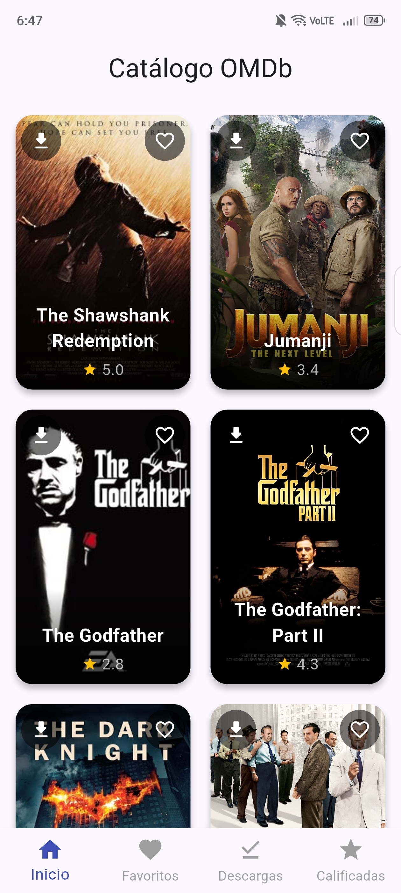
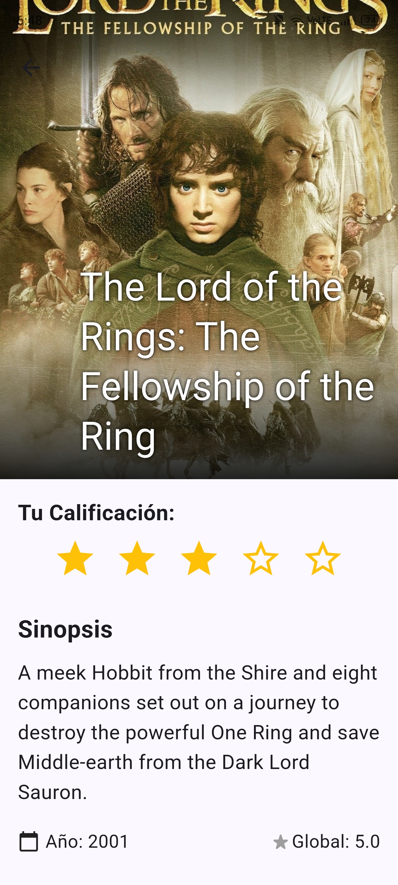
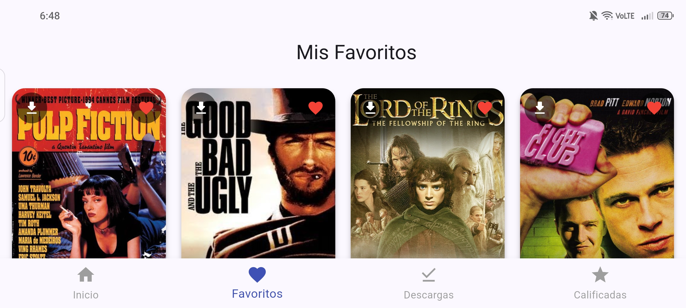

# 🎬 App Películas - Catálogo Profesional

> **Propuesta de Proyecto:**
> Propongo desarrollar una aplicación móvil que consume y visualiza datos en tiempo real desde una API. El objetivo pedagógico es evolucionar de la lógica local al consumo de servicios externos, enfocándome en el manejo de peticiones HTTP, asincronía y parseo de JSON. Incluirá un catálogo de películas en formato GridView con carga eficiente de imágenes, navegación detallada entre pantallas y un sistema de persistencia local para guardar "Favoritos", simulando un flujo de trabajo profesional completo.

---

## 📱 Capturas de Pantalla (Screenshots)

| Catálogo (Home) | Detalle de Película | Menú & Favoritos |
|:---:|:---:|:---:|
|  |  |  |

*(Nota: Las imágenes son demostrativas. La interfaz se adapta a modo Vertical y Horizontal).*

---

## 🚀 Funcionalidades

1.  **Consumo de API REST:** Conexión en tiempo real con `devsapihub` para obtener listados de películas, pósters y calificaciones. 
2.  **Persistencia y Gestión de Estado:**
    * **Favoritos:** Marcado y desmarcado de películas favoritas.
    * **Calificaciones:** Sistema interactivo de 1 a 5 estrellas con ordenamiento (Ascendente/Descendente).
3.  **Descargas Reales:** Capacidad de descargar los pósters de las películas directamente a la **Galería del teléfono** (Android 10+ compatible).
4.  **Diseño Adaptativo (Responsive):** Uso de `OrientationBuilder` para cambiar entre 2 columnas (Vertical) y 4 columnas (Horizontal).

---

## 🛠️ Tecnologías y Librerías Usadas
 
### Dependencias (`pubspec.yaml`)
* **`provider: ^6.x`**: Para la gestión de estado global (patrón Singleton/Observer).
* **`dio: ^5.x`**: Cliente HTTP potente para realizar peticiones a la API y descargas de archivos.
* **`gal: ^2.x`**: Para guardar imágenes en la galería nativa del dispositivo sin problemas de permisos en Android 13+.
* **`path_provider`**: Para acceder a rutas temporales del sistema de archivos.

### Widgets Clave Implementados
* **`GridView.builder`**: Para la renderización eficiente del catálogo.
* **`CustomScrollView` & `SliverAppBar`**: Para el efecto elástico en la cabecera de los detalles.
* **`IndexedStack`**: Para mantener el estado de las pestañas en el `BottomNavigationBar`.
* **`OrientationBuilder`**: Para detectar giros de pantalla.
* **`GestureDetector`**: Para manejar la interactividad en las tarjetas.

---

## Carpetas

```text
lib/
├── config/theme/       # Configuración de colores y tema global
├── models/             # Modelos de datos (Mapeo JSON -> Dart)
│   └── movie.dart
├── providers/          # Lógica de negocio y llamadas a API
│   └── movies_provider.dart
├── screens/            # Pantallas completas
│   ├── home_screen.dart
│   └── movie_details_screen.dart
├── widgets/            # Componentes reutilizables
│   └── movie_grid.dart
└── main.dart           # Punto de entrada